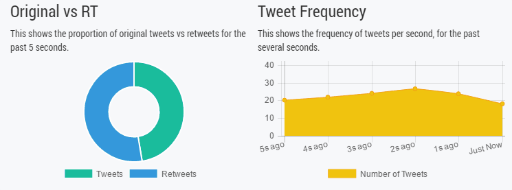

# 📊 Analytics Dashboard
Analytics Dashboard is a real-time HTML5 visualization of twitter data. The stream is captured by a simple .NET Core console application and uses [emitter.io](https://emitter.io) publish/subscribe api to make client talk to the server, check out [emitter on GitHub](https://github.com/emitter-io/emitter). The visualization is done using [ChartistJS library](https://gionkunz.github.io/chartist-js/).

This project utilizes Go for backend processing, WebSockets for live updates, and D3.js for interactive data visualizations. The dashboard is optimized for performance and scalability, ensuring smooth handling of large data streams.

## 🚀 Features
✅ Real-time Analytics – Captures live data streams and updates charts dynamically.
✅ WebSockets Integration – Ensures low-latency updates without page refresh.
✅ Interactive Visualizations – Uses D3.js for customizable charts and graphs.
✅ High Performance – Built with Go for efficient data processing.
✅ Scalable Design – Supports large-scale data ingestion and visualization.
✅ Responsive UI – Optimized for desktop and mobile displays.

## 🛠 Tech Stack
Backend: Go (Golang)

Frontend: HTML5, JavaScript, D3.js

Real-time Communication: WebSockets

Data Processing: Redis (for caching and fast retrieval)

## 📥 Installation
🔹 Prerequisites
Ensure you have the following installed:

Go (latest version)

Node.js & npm

Redis (optional but recommended for caching)

🔹 Clone Repository
bash
Copy
Edit
git clone https://github.com/kelindar/analytics-dashboard.git
cd analytics-dashboard
🔹 Backend Setup (Go Server)
1️⃣ Navigate to the backend directory:

bash
Copy
Edit
cd backend
2️⃣ Install dependencies:

bash
Copy
Edit
go mod tidy
3️⃣ Run the backend service:

bash
Copy
Edit
go run main.go
🔹 Frontend Setup
1️⃣ Navigate to the frontend directory:

bash
Copy
Edit
cd frontend
2️⃣ Install dependencies:

bash
Copy
Edit
npm install
3️⃣ Start the frontend application:

bash
Copy
Edit
npm start
📡 API Endpoints
📌 Fetch Analytics Data
GET /api/analytics

Response:

json
Copy
Edit
{
  "timestamp": "2025-03-29T14:05:00Z",
  "metric": "active_users",
  "value": 1023
}
📌 Stream Live Data (WebSocket)
ws://localhost:8080/ws

Receives live analytics updates in JSON format.

## 📊 Demo

## 💡 How It Works
1️⃣ Data Ingestion – The backend fetches real-time data from an external source (or simulated data).
2️⃣ Processing & Storage – Data is structured, processed, and stored in Redis for fast access.
3️⃣ WebSocket Communication – The backend pushes live updates to the frontend.
4️⃣ Dynamic Visualization – The frontend updates graphs dynamically using D3.js.
